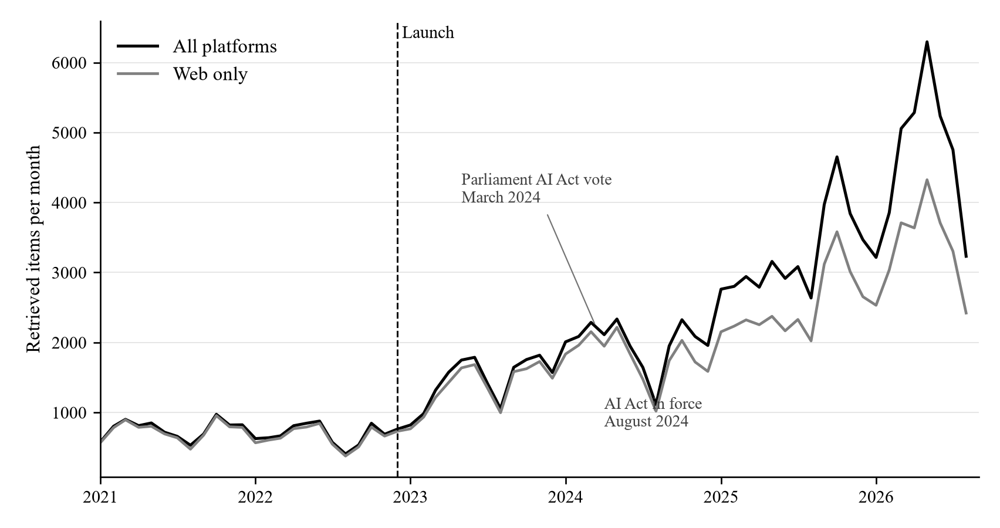
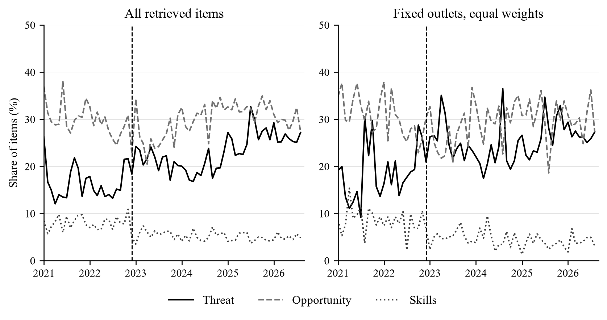
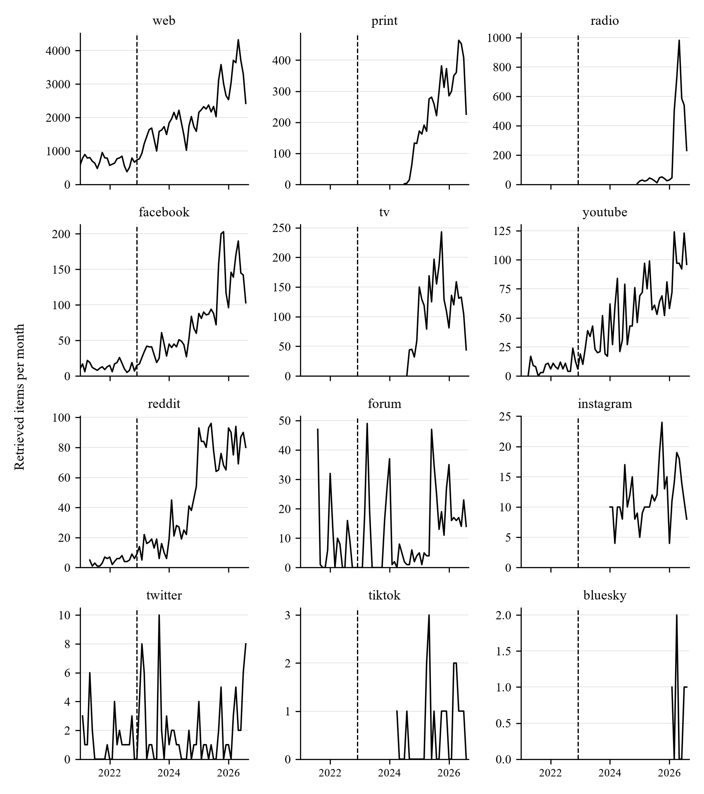

::: {.paper-front}
WORKING PAPER

# After ChatGPT

Media Coverage of AI’s Labour-Market Implications in Croatia

Evidence from a monitored media corpus, 2021–2026

Petra Palić · Luka Šikić · Antea Barišić

Petra Palić — Croatian Catholic University, University Department of Sociology

Luka Šikić — Croatian Catholic University, University Department of Communication Studies

Antea Barišić — University of Zagreb, Faculty of Economics and Business

29 September 2026

**Abstract**

We describe AI-and-labour coverage in a Croatian media-monitoring corpus of 134,751 items from January 2021 to August 2026. Using monthly time-series summaries, dictionary indicators and outlet comparisons, we distinguish growth in recorded coverage from changes in its composition. The pooled count series accelerates after ChatGPT’s release. The mean monthly threat-indicator share rises from 16.5% to 23.0%, while the skills share falls from 8.1% to 5.2%, despite an increase in skills-related item counts. A fixed-outlet, equal-weight analysis shows the same directional contrast. The tabloid differential is negative but rests on few outlet clusters. Engagement associations depend on outcome specification and the treatment of zeros. The evidence is descriptive: there is no untreated comparison, and suspect dates and dictionaries awaiting human validation limit stronger interpretations. The paper contributes a transparent account of changing labour-related narratives and a framework for validating whether risk discussion is accompanied by practical adaptation information.

**Keywords:** artificial intelligence; labour market; media coverage; framing; Croatia

Independent working paper · Preliminary research for discussion
:::

# 1. Introduction

The public release of ChatGPT in November 2022 made generative artificial intelligence (AI) unusually visible in discussions of work. Yet greater visibility does not establish either a sudden change in news production or a change in how journalists describe employment consequences. Coverage can expand while its composition changes gradually, and language about risks can become more common even as the absolute volume of reporting on skills increases. Distinguishing these possibilities is necessary before drawing conclusions about the information available to workers.

This paper studies media items retrieved from a commercial monitoring database for Croatia between January 2021 and August 2026. The corpus contains 134,751 items that satisfy a two-stage AI-and-labour keyword filter. We examine coverage volume, dictionary-defined indicators of risk and opportunity, differences across outlet categories, title similarity across sources, and recorded interactions with web items. A complementary analysis holds the set of named news outlets fixed and gives outlets equal weight. This separates some changes within outlets from changes in their contribution to the aggregate corpus.

The release is a useful calendar reference, but the available design does not identify its causal effect. Every outlet experiences the same event, and there is no untreated comparison series. Moreover, a targeted date audit finds records whose stored dates conflict with their content or publisher information. We therefore interpret the estimates as descriptive changes around the release and subsequent diffusion of generative AI. The word “shock” describes a historically salient event; it is not an identification assumption.

Three findings organise the analysis. First, the pooled count series accelerates after the launch. Second, the monthly share matching the threat dictionary rises from 16.5% to 23.0%, while the skills share falls from 8.1% to 5.2%. These are changes in relative attention: the average monthly count of skills-matching items rises from 58.7 to 133.5. Third, the outlet and engagement results are less decisive than their simplest specifications suggest. The estimated tabloid differential is negative, but the comparison has few outlet clusters. The positive association between threat language and interactions depends on how zeros and the outcome scale are handled.

The contribution is a longitudinal description of AI-and-work coverage in a Croatian monitoring corpus, linked to a transparent measurement and data-quality assessment. It extends the focus of much existing AI-media research from general technological narratives to employment risks, opportunities and adaptation. Its strongest substantive question is whether growing discussion of risk is accompanied by discussion of skills. It does not estimate changes in public beliefs, national employment or the causal consequences of ChatGPT.

# 2. Literature and conceptual framework

## 2.1. Labour-market uncertainty and media framing

Task-based accounts of technological change distinguish displacement from complementarities and the creation of new tasks. Autor explains why automation of some tasks can coexist with continued demand for labour; Acemoglu and Restrepo formalise the opposing forces of automation and new tasks [@autor2015why; @acemoglu2018race]. Studies of AI exposure describe the potential reach of technical capabilities, rather than realised job losses. This distinction applies both to general AI exposure measures and to assessments of large language models [@felten2021ai; @eloundou2024gpts]. Evidence from the introduction of a generative-AI assistant in customer support further shows that effects can differ across workers and depend on the setting [@brynjolfsson2025generative]. These studies motivate separate attention to job loss, job creation, productivity, transformation and skills; they do not imply that a newspaper mentioning any of these topics accurately describes an economic effect.

Framing concerns the selection and emphasis of aspects of an issue, including the problem being defined, its causes, evaluations and possible responses [@entman1993framing]. Scheufele distinguishes media frames from audience frames and the processes linking them [@scheufele1999framing]. That distinction matters here: text is observed, audience interpretation is not. De Vreese's distinction between generic and issue-specific frames also cautions against treating any negative word as a complete frame [@devreese2005framing]. Generic categories such as conflict, responsibility and economic consequences provide a useful conceptual backdrop, but require explicit operationalisation in a particular corpus [@semetkovalkenburg2000].

We translate this literature into a narrower empirical object: lexical indicators of labour-related narratives inside a keyword-selected corpus. Job-loss and inequality expressions approximate possible problems; productivity and job-creation expressions approximate possible benefits; skills and regulation expressions approximate adaptation or collective responses. Transformation can describe either beneficial or costly adjustment and is therefore not intrinsically positive. The “opportunity” composite retains transformation for comparability with the initial specification, while disaggregated results allow readers to assess that choice. Threat and opportunity indicators are non-exclusive, and neither is a direct measure of sentiment, factual accuracy or audience persuasion.

## 2.2. AI news, negativity and outlet differences

Earlier research shows that AI coverage combines optimism with identifiable areas of concern. Fast and Horvitz document long-run changes in newspaper discussion, including growing concern about work [@fasthorvitz2017]. Chuan, Tsai and Cho find benefits discussed more often than risks in their newspaper sample, with risks often described more specifically [@chuan2019framing]. Ouchchy, Coin and Dubljević examine the ethical dimensions of AI reporting and emphasise limitations in the depth of coverage [@ouchchy2020headlines]. These findings support analysing the content of risk language alongside its frequency.

Nguyen and Hekman find that AI discourse became more critical over time and link media narratives to data risks and public understanding [@nguyenhekman2024]. Roe and Perkins show how UK headlines shortly after ChatGPT's release alternated between promise and danger [@roeperkins2023]. The Croatian case adds a longer post-release horizon and an explicit labour-market filter. It also requires attention to language-specific measurement. We make no claim that the Croatian labour market has the same occupational exposure or media concentration as neighbouring countries.

Negativity may attract attention, but several distinct mechanisms are possible. Studies of reactions to news demonstrate sensitivity to negative information [@soroka2015negativity; @soroka2019crossnational]. A large randomised headline study finds that negative wording can increase clicks in its setting [@robertson2023negativity]. That experimental result motivates an engagement question here; it does not identify the effect of negativity in observational Croatian interaction data. Article topic, prominence, audience size, distribution channels and measurement practices can influence both language and recorded engagement.

Media-economics accounts connect content to audience preferences and market incentives [@mullainathanshleifer2005; @gentzkowshapiro2010]. They permit competing expectations about outlet differences. Popular outlets may emphasise emotionally vivid risks; general-interest outlets serving professionally exposed readers may devote more attention to occupational consequences. “Tabloidisation” is itself multidimensional, involving style, topic selection and editorial priorities [@esser1999tabloidization]. Our outlet categories are research classifications, not official ratings of journalistic quality or direct measures of business models.

## 2.3. Research questions

The analysis addresses four questions. How does the amount of retrieved AI-and-labour coverage evolve around the launch? Do risk, opportunity and skills indicators change together or diverge? Are changes similar across outlet categories and within a fixed set of outlets? Finally, how do lexical indicators relate to title similarity and recorded engagement? All specifications are exploratory: the observation window and dictionaries were not preregistered, and the robustness analyses were developed during manuscript review. Statistical significance is therefore treated as one diagnostic, alongside magnitude, specification sensitivity and data validity.

# 3. Data, market scope and measurement

## 3.1. Corpus construction and observation unit

The source is one Determ database covering 68 consecutive calendar months, with 23 months before December 2022 and 45 months from December 2022 onward. SQL first requires an AI-related expression and a labour-related expression in the concatenated title and full text. A second regular-expression filter refines the selection. Items classified as reader comments are excluded. Exact repeats of the same title, stored date and source are removed. An observation is a retrieved item, rather than a unique underlying story or an individual reader's exposure.

The retrieval vocabulary includes automation, robotisation and algorithms as well as generative AI and named products. Consequently, the study concerns the evolution of a broad AI-and-labour discussion around ChatGPT, rather than a corpus restricted to ChatGPT. The two filtering stages are not identical: some terms recognised at the regular-expression stage, including standalone wage or employer expressions, are absent from the SQL prefilter. A record must pass both stages. The resulting scope is narrower than the union of the two vocabularies, and corpus recall has not been established. The code and exact dictionaries accompany the reproducible source.

Web items account for 82.8% of the corpus. The remainder includes social posts, public forum posts and print or broadcast items. It would therefore be inaccurate to call every pooled observation a digital news article. Table 1 gives platform counts and first observed qualifying items. Instagram is included, with 372 items; its first observed item occurs in Jan 2024, so it cannot support a pre-launch comparison.

**Table 1. Platform composition**

| Platform | Pre | Post | Total | Share (%) | First item |
| --- | ---: | ---: | ---: | ---: | ---: |
| web | 15,959 | 95,598 | 111,557 | 82.8 | Jan 2021 |
| print | 0 | 6,295 | 6,295 | 4.7 | Jul 2024 |
| radio | 0 | 4,028 | 4,028 | 3.0 | Dec 2024 |
| facebook | 300 | 3,523 | 3,823 | 2.8 | Jan 2021 |
| tv | 0 | 2,880 | 2,880 | 2.1 | Aug 2024 |
| youtube | 167 | 2,532 | 2,699 | 2.0 | Apr 2021 |
| reddit | 88 | 2,181 | 2,269 | 1.7 | May 2021 |
| forum | 143 | 546 | 689 | 0.5 | Aug 2021 |
| instagram | 0 | 372 | 372 | 0.3 | Jan 2024 |
| twitter | 28 | 88 | 116 | 0.1 | Feb 2021 |
| tiktok | 0 | 18 | 18 | 0.0 | Apr 2024 |
| bluesky | 0 | 5 | 5 | 0.0 | Feb 2026 |

*Note:* Pre: January 2021–November 2022. Post: December 2022–August 2026. Shares use all retrieved items. First item is the first qualifying observation for that platform.

The public-forum category contains named discussion boards rather than an unspecified national sample. Forum.hr accounts for 61.8% of forum items, followed by the Bug.hr forum and boards including Osijek031. Reddit is a separate platform category. Titles and complete item texts can contain quotations, navigation text or unrelated material. Database language tags do not by themselves certify Croatian language or a Croatian audience. The named-outlet analysis provides a more geographically interpretable subset of the broader monitored corpus.

## 3.2. Named outlets and what “coverage” means

The named web-outlet subset contains 37,435 items from 16 observed outlets, representing 27.8% of all retrieved items and 33.6% of web items. These are corpus shares, not shares of national readership, advertising revenue or the Croatian population. The Reuters Institute's country report documents major brands and their ownership, but its survey reach measures cannot be added across brands to estimate unduplicated coverage of our corpus [@perusko2024croatia]. No defensible national market-coverage percentage is available from the present extract.

Ownership and the sampling frame are distinct. In the ownership context reported for 2024, Styria includes 24sata and Večernji list; Hanza includes Jutarnji list and Slobodna Dalmacija; United Group includes the Nova TV/Dnevnik and N1 operations; and RTL belongs to CME [@perusko2024croatia]. Net.hr's transfer from Telegram to RTL was announced in 2021 [@nethr2021rtl]. We do not count 24sata as an owner group separate from Styria, nor treat these ownership descriptions as an exhaustive or time-invariant ownership census. Additional public, regional, specialist and business outlets broaden the sample beyond the largest general-interest brands. Dnevnik.hr is explicitly included in this expanded named-outlet set.

Classification is performed by the authors using a documented mapping of web domains. A host must match a listed domain or one of its subdomains; the separately operated emedjimurje.net.hr host is excluded from Net.hr. “Tabloid” identifies 24sata, Index.hr and Net.hr; “quality” is shorthand for the general-interest comparison category listed in Table 2. These labels do not come from an official database classification. Other named outlets are grouped as regional, public, technology or business media. The classifications are held fixed for analysis, without assuming that ownership or editorial practice is fixed over time.

**Table 2. Named web outlets**

| Outlet | Type | Pre | Post | Total | Months |
| --- | ---: | ---: | ---: | ---: | ---: |
| Lider | Business | 558 | 2,140 | 2,698 | 68 |
| Poslovni dnevnik | Business | 443 | 3,397 | 3,840 | 68 |
| HRT | Public | 110 | 943 | 1,053 | 67 |
| Dnevnik.hr | Quality | 358 | 3,710 | 4,068 | 68 |
| Jutarnji list | Quality | 774 | 2,414 | 3,188 | 68 |
| N1 Hrvatska | Quality | 10 | 795 | 805 | 47 |
| Telegram | Quality | 153 | 995 | 1,148 | 65 |
| Tportal | Quality | 505 | 3,731 | 4,236 | 68 |
| Večernji list | Quality | 529 | 2,447 | 2,976 | 67 |
| Novi list | Regional | 228 | 1,625 | 1,853 | 68 |
| Slobodna Dalmacija | Regional | 308 | 1,110 | 1,418 | 68 |
| 24sata | Tabloid | 289 | 1,797 | 2,086 | 68 |
| Index.hr | Tabloid | 323 | 2,669 | 2,992 | 68 |
| Net.hr | Tabloid | 34 | 1,376 | 1,410 | 50 |
| Bug | Tech | 383 | 2,536 | 2,919 | 68 |
| Netokracija | Tech | 223 | 522 | 745 | 67 |

*Note:* Authors’ domain-based categories. Months counts months with at least one qualifying item. Forbes is configured but contributes no items. Counts refer to web items only.

## 3.3. Dates and duplicated stories

A targeted chronology check identifies 4 stored pre-launch items containing “ChatGPT” whose publisher information or described events point to later dates. These include a Dnevnik.hr article displayed as published in March 2023, two Noć knjige event pages referring to April 2023, and an Osiguranje.hr story listed by the publisher in September 2023. Event dates and publication dates are not interchangeable. We preserve the stored dates in the baseline to make it reproducible, then exclude these records in a sensitivity analysis. This check does not estimate the prevalence of date errors elsewhere in the archive. It prevents interpreting the suspect observations as demonstrated anticipation of the launch. Appendix C provides an audit trail.

Cross-platform duplication remains possible after exact item deduplication. Normalised headline matching within a two-day window finds 20 web-linked matches among 3,823 Facebook posts (0.5%). This restrictive rule misses shortened captions, rewritten titles and delayed reposts, so it is a lower-bound-style diagnostic rather than an estimate of all shared content. Platform-level observations are kept distinct because they describe monitored distribution, while dependence across versions of a story remains a limitation.

## 3.4. Dictionary indicators and validation status

Each indicator equals one when at least one configured expression matches the lowercased title-plus-text field. The dictionaries cover job loss, job creation, transformation, skills, regulation, productivity, inequality, and fear or resistance. The threat composite is the union of job loss, fear/resistance and inequality. The opportunity composite is the union of job creation, productivity and transformation. Multiple indicators may be present in the same item; their percentages need not sum to one hundred. Appendix A gives the conceptual mapping and the complete expressions.

These measures have not yet been validated against independent human coding. A generic word such as “danger” or “warning” need not refer to AI or employment, and a skills term can occur in a product review. Negation, quoted speech and the distinction between a journalist's claim and an attributed claim are not modelled. Dictionary matches therefore measure lexical prevalence in the retrieved text, not established semantic frames. Automated content analysis requires application-specific validation [@grimmerstewart2013].

Measurement error need not merely attenuate every result. False positives, false negatives and their variation by outlet, period, text length or platform can change both levels and trends. Under stable sensitivity and specificity, a binary prevalence difference is scaled by their sum minus one; stability is an assumption to test, not a property of this corpus. Appendix B specifies a blinded coding protocol and reporting requirements. No human-coding accuracy, intercoder agreement or corrected prevalence is reported as an observed result.

# 4. Empirical approach

## 4.1. Temporal summaries and segmented regressions

We report both item counts and monthly percentages. Unless explicitly stated otherwise, a pre- or post-period percentage is an unweighted mean of monthly percentages. An item-weighted share answers a different question when coverage volume grows; the outlet-type tables identify that alternative denominator explicitly. December 2022 is the first full month after the public release.

For monthly volume or an indicator share, the segmented specification is

$$Y_t = \alpha + \beta t + \delta P_t + \gamma (t-t_0)P_t + \varepsilon_t,$$

where $P_t$ indicates December 2022 onward and $t_0$ is the launch-month index. The coefficient $\delta$ is the fitted level difference at the boundary; $\gamma$ is the change in slope. Centring the interaction at $t_0$ is essential for interpreting the level coefficient. A negative level estimate in an uncentred model does not, on its own, indicate an immediate fall at the launch.

Time-series standard errors use the default Andrews quadratic-spectral heteroskedasticity-and-autocorrelation-consistent covariance estimator in the R package `sandwich`, through `vcovHAC`. They are not described as Newey–West errors. A separate window sensitivity uses a Bartlett/Newey–West estimator with a three-month lag and no prewhitening. Residual dependence and the short series still limit precision. Interrupted-time-series guidance emphasises the importance of concurrent events, temporal structure and a credible counterfactual [@bernal2017interrupted]. Here the regressions summarise observed trajectories rather than identify an intervention effect.

We also estimate a common-trend model, $Y_t=\alpha+\beta t+\theta P_t+\varepsilon_t$. Its post coefficient imposes a common slope across the boundary and is not the same quantity as either a long-run change or a segmented slope change. Window comparisons use the same model but vary the available pre- and post-periods. Table 7 reports their actual lengths; the longest requested windows are not symmetric because the archive begins in 2021. Holm-adjusted probabilities are shown for the family of window tests. Breakpoint estimates select changes from the observed series; their confidence intervals are conditional on that statistical model and do not establish which historical event caused a break.

For the count series, the Bai–Perron least-squares procedure fits multiple breaks in a linear trend, with a minimum segment fraction of 0.15 and the number of breaks selected by the Bayesian information criterion. Nominal confidence intervals use the 95% default in `strucchange`. Reported break dates follow the package convention: each marks the last month of the preceding segment. These model-based dates need not coincide with the month when a new trajectory begins.

## 4.2. Outlet comparisons and composition

For the tabloid comparison, the preferred linear-probability specification includes outlet and calendar-month fixed effects:

$$D_{it} = \alpha_{o(i)} + \lambda_t + \tau\bigl(P_t\times T_{o(i)}\bigr) + u_{it},$$

where $D_{it}$ is the item-level threat indicator and $T_o$ denotes the tabloid category. The interaction estimates the differential post-period change relative to the comparison category; it is not an absolute decline in tabloid threat language. Standard errors are clustered by outlet and calendar month. With 9 outlets, only 3 in the tabloid category, conventional cluster inference is fragile. Equal outlet-month weights and leave-one-out comparisons assess sensitivity. The earlier custom wild-bootstrap result is not used as verified evidence because its treatment of fixed effects requires independent validation. Small-cluster methods do not remove the need to assess design and model assumptions [@cameronGelbachMiller2008; @mackinnonWebb2017].

To examine composition more directly, we identify named outlets with at least one qualifying item in every observed month, calculate their within-outlet shares, and average them with equal outlet weights. This subset contains 10 outlets and 29,298 items. It holds outlet identities and weights fixed, while selecting outlets on observed corpus participation. The subset is used as a robustness and interpretation exercise, not as a population-weighted estimate.

## 4.3. Title similarity and engagement

Title similarity uses unique alphabetic tokens of at least four letters, requiring at least three tokens per title. Candidate pairs must be from different sources, within three days, and share one of the two rarest tokens selected from each title. A pair is classified as similar when token-set Jaccard similarity reaches 0.70. Candidate blocking improves computational tractability but can miss similar pairs. The resulting label is “matched title”, not “agency copy”; unmatched items cannot be assumed to be original reporting.

For web items, we regress log of one plus recorded interactions on the threat and opportunity indicators with source and month fixed effects, then use source-by-month effects. We also estimate a log model restricted to positive outcomes and a Poisson pseudo-maximum-likelihood model with source-by-month effects. Source-clustered standard errors allow within-source dependence. Exponentiating a log-one-plus coefficient does not yield a percentage change in expected interaction counts when zeros are present [@chenroth2024]. The outcome also lacks a verified common capture horizon and a demonstrated distinction between genuine zeros and unavailable metrics. These regressions describe association and measurement sensitivity, not audience demand caused by framing.

# 5. Results

## 5.1. Coverage volume after the launch

The pooled segmented model estimates a level change of 15.4 items at December 2022 ($p=0.947$) and a slope change of 92.8 additional items per month for each month elapsed ($p< 0.001$). The first estimate is imprecise; the second describes substantial acceleration in the recorded series. It does not imply that every month gains that many items because of ChatGPT. The web-only model estimates a level change of 280.2 items ($p=0.029$), showing that a categorical “acceleration without a jump” conclusion is sample-dependent.

**Figure 1. Monthly coverage volume**

{width=6.35in}

*Note:* Retrieved counts. Dashed line: December 2022, the first full post-launch month. AI Act dates are contextual annotations, not estimated effects.

**Table 3. Segmented monthly volume models**

| Sample / coefficient | Estimate | SE | p |
| --- | ---: | ---: | ---: |
| All: Pre-period slope | −4.70 | 1.50 | 0.003 |
| All: Level at launch | 15.36 | 229.96 | 0.947 |
| All: Slope change | 92.85 | 10.56 | < 0.001 |
| Web: Pre-period slope | −5.57 | 1.36 | < 0.001 |
| Web: Level at launch | 280.19 | 125.19 | 0.029 |
| Web: Slope change | 60.90 | 6.17 | < 0.001 |

*Note:* Outcome: monthly item count. Level: items; slopes: items per month. Models include intercept, linear time, post and centred post-by-time interaction. Andrews HAC errors; 68 months per model. Residual autocorrelation remains: pooled Breusch–Godfrey test, order three, p < 0.001.

Data-selected breakpoints occur in February 2023 and June 2024, with model-based confidence intervals of January 2023–April 2023 and September 2023–July 2024, respectively. The first interval does not contain December 2022. These are descriptive changes in the count series, not proof of a specific diffusion mechanism. A December 2021 placebo fitted only to the pre-launch sample gives level and slope probabilities of 0.624 and 0.466. Failure to detect that placebo is a limited specification check, not validation of the main design.

## 5.2. Risk and skills occupy different shares of a larger discussion

Table 4 distinguishes raw period means from common-trend-adjusted coefficients. The monthly threat share is higher in the post period, while opportunity changes from 30.0% to 29.8%. The skills indicator falls by 2.9 percentage points in raw monthly means. Its common-trend post coefficient is −2.47 percentage points ($p< 0.001$). By contrast, the full-period threat post coefficient is 1.19 percentage points ($p=0.545$), which does not distinguish a discrete launch-associated shift from the fitted trend.

**Figure 2. Monthly lexical indicators**

{width=6.35in}

*Note:* Unsmoothed monthly shares. Right panel: 10 named outlets with items in every month, equally weighted. Dashed vertical line marks December 2022. Indicators are non-exclusive and unvalidated.

**Table 4. Indicator prevalence and common-trend estimates**

| Indicator | Pre (%) | Post (%) | Post coef. | SE | p |
| --- | ---: | ---: | ---: | ---: | ---: |
| Threat composite | 16.5 | 23.0 | 1.19 | 1.95 | 0.545 |
| Opportunity composite | 30.0 | 29.8 | −3.52 | 2.33 | 0.136 |
| Job loss | 1.4 | 2.5 | 0.79 | 0.57 | 0.168 |
| Job creation | 5.0 | 4.3 | −0.31 | 0.66 | 0.634 |
| Transformation | 5.0 | 4.8 | 0.32 | 0.74 | 0.666 |
| Skills | 8.1 | 5.2 | −2.47 | 0.52 | < 0.001 |
| Regulation | 3.7 | 5.4 | 0.95 | 0.70 | 0.176 |
| Productivity | 24.4 | 25.1 | −3.18 | 2.05 | 0.126 |
| Inequality | 2.1 | 2.3 | 0.10 | 0.38 | 0.789 |
| Fear / resistance | 14.3 | 20.3 | 0.75 | 2.17 | 0.729 |

*Note:* Pre/post values are equally weighted monthly means. Coefficients and standard errors are percentage points from separate share ~ time + post regressions with Andrews HAC errors. Categories overlap; probabilities are unadjusted exploratory diagnostics.

The absolute monthly count of skills-matching items increases from 58.7 to 133.5. Thus the evidence supports a decline in skills' share of the retrieved discussion, while its recorded volume expands. It does not support the claim that fewer skills-related items were published or that readers encountered less guidance. The dictionary itself does not establish whether a skills reference supplies useful advice. Likewise, approximate stability of a period-average opportunity share should not be read as a flat trajectory throughout the period.

The fixed-outlet analysis sharpens this distinction. In the balanced, equally weighted subset, the threat share changes from 18.6% to 25.3%, and the skills share from 8.5% to 4.5%. Table 5 separates risk without skills, skills without risk, their co-occurrence and neither. This makes explicit whether the risk–skills relationship reflects coexistence inside items or a reallocation across different items. These descriptive categories concern word matches; establishing whether risk reporting provides an actionable response requires human coding.

**Table 5. Risk and skills within a fixed outlet set**

| Item category | Pre (%) | Post (%) | Change (pp) |
| --- | ---: | ---: | ---: |
| Threat without skills | 17.2 | 24.4 | 7.2 |
| Threat and skills | 1.4 | 0.9 | −0.5 |
| Skills without threat | 7.1 | 3.6 | −3.6 |
| Neither | 74.3 | 71.1 | −3.1 |

*Note:* 10 named outlets with qualifying items in every month; equal outlet weights within month, then equal month weights within period. Categories are mutually exclusive and exhaustive. Percentages may differ slightly from one hundred because of rounding.

## 5.3. Outlet categories and inference

Table 6 aggregates counts and item-weighted indicator shares by outlet type. It provides the composition information needed to interpret comparisons across editorial categories. The residual “other web” category contains heterogeneous sources and should not be treated as a coherent editorial model. Non-web observations combine distinct platforms whose coverage changes over time.

**Table 6. Counts and indicators by outlet type**

| Type | Items | Threat pre | Threat post | Skills pre | Skills post |
| --- | ---: | ---: | ---: | ---: | ---: |
| Tabloid | 6,488 | 22.1 | 25.6 | 8.7 | 3.9 |
| Quality | 16,421 | 18.4 | 29.1 | 8.7 | 3.9 |
| Regional | 3,271 | 18.3 | 23.9 | 7.8 | 4.7 |
| Public | 1,053 | 12.7 | 21.8 | 7.3 | 4.1 |
| Tech | 3,664 | 14.4 | 20.1 | 10.1 | 6.2 |
| Business | 6,538 | 18.9 | 27.2 | 8.3 | 5.1 |
| Other web | 74,122 | 16.3 | 21.7 | 8.0 | 5.5 |
| Non-web | 23,194 | 3.9 | 26.9 | 6.2 | 4.9 |

*Note:* Shares are item-weighted percentages within type and period. Named types include web items only. Other web and non-web are residual groups. “Quality” denotes the authors’ comparison category, not an official rating.

In the outlet-and-month fixed-effects model, the tabloid interaction is −5.72 percentage points (standard error 2.45; $p=0.048$). The negative sign means that the post-period rise in the tabloid category is smaller than in the comparison category, conditional on this specification. It does not mean that tabloids became absolutely less threatening. Equal outlet-month weighting gives −7.50 percentage points. Leave-one-out estimates range from −7.29 to −3.68 percentage points, with probabilities from 0.030 to 0.123. The sign contradicts the simple prediction of a larger tabloid rise, but limited cluster support and specification sensitivity argue against declaring that theory decisively rejected.

## 5.4. Timing and robustness

The window estimates are not a monotonic sequence. The requested eighteen-month window gives 5.89 percentage points ($p=0.062$), and the requested twenty-four-month window gives 5.75 percentage points ($p=0.019$). The latter uses 23 pre-period and 24 post-period months. Its Holm-adjusted probability across the reported window family is 0.112. These exploratory comparisons suggest sensitivity to the time horizon rather than establish a robust delayed treatment effect.

**Table 7. Window sensitivity for the threat share**

| Requested ±mo. | Pre / post | Estimate | SE | p | Holm p |
| --- | ---: | ---: | ---: | ---: | ---: |
| 6 | 6 / 6 | −1.62 | 3.40 | 0.645 | 1.000 |
| 9 | 9 / 9 | 1.83 | 3.75 | 0.632 | 1.000 |
| 12 | 12 / 12 | 4.45 | 3.30 | 0.193 | 0.770 |
| 18 | 18 / 18 | 5.89 | 3.04 | 0.062 | 0.309 |
| 24 | 23 / 24 | 5.75 | 2.35 | 0.019 | 0.112 |
| 36 | 23 / 36 | 1.44 | 2.32 | 0.536 | 1.000 |

*Note:* Post coefficient in share ~ time + post; percentage points; Andrews HAC errors. Requested windows are truncated by data availability. Holm adjustment covers these 6 tests. Newey–West lag-three probabilities are 0.044 for the eighteen-month window and 0.014 for the twenty-four-month window.

**Table 8. Sample and measurement sensitivity**

| Specification | Estimate (pp) | SE | p |
| --- | ---: | ---: | ---: |
| Full corpus | 1.19 | 1.95 | 0.545 |
| Web only | 2.22 | 1.78 | 0.216 |
| Named outlets | 2.87 | 2.15 | 0.186 |
| Excluding suspect dates | 1.20 | 1.95 | 0.540 |
| Excluding January 2023 | 0.67 | 1.95 | 0.731 |
| Threat excluding fear | 0.92 | 0.55 | 0.098 |
| Balanced, equal outlet weights | 3.47 | 2.94 | 0.242 |

*Note:* Full-period common-trend regressions. Balanced specification averages within-outlet shares equally across continuously represented outlets. Threat without fear is job loss or inequality. It changes the construct as well as the estimate.

Excluding the known suspect dates changes the common-trend estimate from 1.19 to 1.20 percentage points. This small numerical change does not resolve the broader chronology problem because the targeted audit was not a representative date-validation exercise. Web-only, named-outlet and equal-weight estimates answer related but different descriptive questions. Removing fear/resistance from the threat composite also changes its meaning, isolating the more explicitly economic job-loss and inequality components. These checks should be read as a profile of measurement and specification dependence.

## 5.5. Similar titles and recorded interactions

Among titles eligible for the similarity procedure, 26.0% of pre-launch and 22.1% of post-launch items have a match. Their threat shares are 12.8% and 20.4%, compared with 17.7% and 25.0% for unmatched items. Similar-title items therefore have lower threat prevalence in each period, while threat prevalence rises in both groups. These observations neither identify wire-service origin nor rule out a contribution of redistributed stories to the aggregate change.

**Table 9. Engagement specification sensitivity**

| Model | Threat (SE) | p | Opportunity (SE) | p | N |
| --- | ---: | ---: | ---: | ---: | ---: |
| Log(1+y), source + month | 0.099 (0.024) | < 0.001 | −0.060 (0.021) | 0.005 | 110,827 |
| Log(1+y), source × month | 0.102 (0.027) | < 0.001 | −0.078 (0.022) | < 0.001 | 101,288 |
| Log(y), positive only | 0.025 (0.028) | 0.374 | −0.092 (0.019) | < 0.001 | 41,688 |
| Poisson, source × month | 0.214 (0.208) | 0.304 | −0.078 (0.109) | 0.472 | 65,692 |

*Note:* Web items. Coefficients are on the stated outcome/link scale, not percentage effects from log(1+y). Source-clustered standard errors in parentheses. Positive-only model has additive source and month effects. Retained samples differ with singleton and all-zero-group removal; all models include both indicators.

The baseline log-one-plus engagement coefficient on threat is 0.099 (standard error 0.024), while the opportunity coefficient is −0.060. However, the threat coefficient is 0.025 in the positive-outcome log model ($p=0.374$) and 0.214 in the count model ($p=0.304$). Models also retain different samples because of zeros, singleton fixed effects and all-zero groups. The share of web observations with recorded zero interactions rises from 41.6% in 2021 to 92.9% in the final partial year. Without resolving the meaning and capture timing of those zeros, the evidence does not establish that threat framing raises expected interactions or that reader demand caused the observed content changes.

# 6. Discussion

## 6.1. Interpretation and contribution

The central substantive pattern is a change in the balance of a growing recorded discussion. Risk language occupies a larger share after the launch, and skills language a smaller share, but a single launch dummy does not summarise the whole trajectory. The contrast between relative and absolute skills attention is especially important: journalists can produce more skills-related items while those items become less prominent within the expanding topic. A claim of neglect requires a justified benchmark for adequate coverage and validation of what the articles actually recommend.

The evidence also qualifies a simple tabloid-versus-quality account of technological fear. The point estimates show a larger post-period increase in the comparison category, which is consistent with professional exposure being newsworthy to its audiences. Audience composition is not observed, however, so this remains a possible explanation. Changes in content supply, story selection and international reporting are alternatives. Similarly, a positive coefficient in one engagement model cannot establish a demand mechanism when the relationship is sensitive to the outcome scale and the availability of interaction data.

This case is relevant to research on smaller-language media systems because it demonstrates how longitudinal scale and semantic validity must be considered jointly. Transparent outlet mappings, platform shares, provenance and co-occurrence measures make the description more interpretable. They do not transform the analysed items into a representative census of what Croatian residents read.

## 6.2. Croatian policy relevance

The practical policy question is whether information about occupational uncertainty is connected to accessible forms of adaptation. Croatia already has an institutional route through the Croatian Employment Service (HZZ) voucher system, which supports eligible employed and unemployed adults in acquiring green, digital and other demanded skills. Its programme catalogue and career-guidance service provide concrete resources that labour-market reporting could help readers locate [@hzz2026vouchers]. This is a communication proposal, not an estimated programme effect: reporting could identify which workers a story concerns, what training is relevant, what eligibility conditions apply, and where verified advice is available.

A second useful direction is to distinguish capability claims from realised adoption and employment outcomes. Enterprise surveys and occupational evidence can provide that context; this corpus cannot substitute for them. A third is to code whether risk-focused items offer verifiable routes to training, workplace consultation or explanation of employment-related rights. The EU AI Act's parliamentary adoption and entry into force fall within the extended observation window and are retained as contextual dates, not as separately identified interventions [@europeanparliament2024; @europeancommission2024]. No legal effect or Croatian implementation outcome is inferred from an annotation on a chart.

## 6.3. Limits and requirements for stronger claims

The main unresolved constraints are human validation and chronology. Independent coding should establish whether dictionary matches actually concern AI's labour implications and whether their errors differ across time and outlets. Date checks should compare stored timestamps with publisher metadata in a stratified sample, retaining original values and a documented resolution rule. Correcting the known cases alone would not establish overall validity.

Stronger causal interpretation would require a justified comparison series or a separate design with credible exposure variation, together with valid measurement. For engagement, a common observation horizon, reliable treatment of unavailable metrics and a design addressing topic selection would be necessary. None of these limitations is resolved by small probabilities in the current regressions.

# 7. Conclusion

AI-and-labour coverage expands substantially in the monitored corpus after ChatGPT's release. Its lexical composition shifts toward risk and away from skills in relative terms, while skills-related item counts increase. The evidence does not isolate a causal launch effect, decisively reject an outlet theory, or establish that threat language causes engagement. A more defensible contribution is the documented evolution of labour-related narratives, with explicit separation of counts, shares, outlet composition and measurement uncertainty. The next empirical step is to validate the semantic and temporal measures before making stronger claims about framing or its consequences.

# References

::: {#refs}
:::

# Appendix A. Measurement specification

The conceptual categories below guide interpretation; they are not a validated coding instrument. All expressions are matched as regular expressions against lowercased title and full text, without a proximity requirement linking the expression to an AI or labour term. There is no automatic stemming or negation handling. Listed expressions are alternatives within a dictionary. Corpus entry separately requires passing both retrieval stages described in Section 3.1.

**Job loss.** AI eliminates jobs. Expressions: gubitak posla; gubitak poslova; gubitak radnih mjesta; ukidanje radnih mjesta; ukidanje poslova; zamjena radnika; zamijeniti radnike; zamjenjuje radnike; istisnuti radnike; istiskivanje; otpuštanje; otpuštanja; nestanak poslova; nestanak zanimanja; suvišan; suvišni radnici; tehnološka nezaposlenost; krade poslove; krade posao; oduzima posao; prijeti radnim mjestima; ugrožava radna mjesta.

**Job creation.** AI creates new opportunities. Expressions: nova radna mjesta; novi poslovi; novo zapošljavanje; nove prilike; nove mogućnosti; stvaranje poslova; rast zapošljavanja; povećanje zapošljavanja; nova zanimanja; nova karijera; potražnja za stručnjacima; nedostatak radnika; deficitarna zanimanja.

**Transformation.** AI transforms rather than destroys work. Expressions: transformacija rada; transformacija poslova; promjena načina rada; mijenja način rada; prilagodba; prilagoditi se; prilagođavanje; nadopunjuje; komplementar; suradnja čovjeka i; čovjek i stroj; evolucija poslova; evolucija rada; nove uloge; promijenjena uloga; ne zamjenjuje nego.

**Skills.** Focus on reskilling and education. Expressions: prekvalifikacija; dokvalifikacija; cjeloživotno učenje; digitalna pismenost; digitalne vještine; nova znanja; nove vještine; jaz u vještinama; nedostatak vještina; reskilling; upskilling; obrazovanje za budućnost; stem vještine; programiranje.

**Regulation.** Policy, governance, and worker protection. Expressions: regulacija ai; regulativa; zakon o ai; zakonski okvir; eu regulativa; ai act; etička pitanja; etika ai; sindikat; sindikalni; zaštita radnika; prava radnika; socijalna zaštita.

**Productivity.** Economic benefits and efficiency. Expressions: produktivnost; povećanje produktivnosti; učinkovitost; efikasnost; ušteda; smanjenje troškova; konkurentnost; konkurentna prednost; gospodarski rast; ekonomski rast; optimizacija.

**Inequality.** Distributional concerns and digital divide. Expressions: nejednakost; rastuća nejednakost; digitalni jaz; tehnološki jaz; socijalna nejednakost; polarizacija; jaz u plaćama; ranjive skupine; marginalizirani; srednja klasa; nestanak srednje klase.

**Fear / resistance.** Anxiety, fear, and opposition to AI. Expressions: strah od ai; strah od gubitka; strah od tehnologij; prijetnja; opasnost; apokalipsa; distopija; katastrofa; upozorenje; alarm; otpor prema; protivljenje; neizvjesnost; nesigurnost; panika; zabrinutost.

# Appendix B. Human-validation protocol

Validation should separate corpus relevance from frame measurement. First, coders should decide whether an item substantively discusses AI and work, distinguish news from other genres, and identify the relevant text span. Second, they should code each labour-related narrative and whether it is asserted, questioned, negated or attributed to a speaker. Third, they should code whether any skills reference gives a concrete adaptation option. This avoids treating a passing word match as a complete frame or as actionable guidance.

Use independently working Croatian-language coders who do not see the automated label. Stratify the sample across pre- and post-launch periods, outlet categories and platforms. Include both dictionary-positive and dictionary-negative items, oversampling rare indicators with known inclusion probabilities. Keep a randomly sampled component to estimate corpus prevalence and record sampling weights. A small pilot can refine the codebook, but the final sample size should be chosen to achieve useful precision for the rarest substantively important indicators rather than treating a fixed small total as sufficient for every category.

Before adjudication, report agreement and disagreement by category, alongside an appropriate chance-corrected agreement statistic. Against adjudicated labels, report weighted precision, recall, specificity and uncertainty intervals separately by period and outlet category. Reserve an untouched evaluation subset if the dictionaries are revised. Publish de-identified labels, codebook versions and reproducible sampling code where the data licence permits. Date verification should be a separate annotation field, with publisher timestamp, retrieval timestamp, revision history and unresolved cases distinguished. These are prospective requirements; this working paper does not report completed human validation.

# Appendix C. Data-quality and sensitivity details

## C.1. Chronology checks

**Table C1. Flagged chronology inconsistencies**

| Stored date | Source link | Publisher evidence |
| --- | ---: | ---: |
| 22 Apr 2022 | [nocknjige.hr](http://nocknjige.hr/program.php?program_id=8782) | FER event page: April 2023 programme |
| 25 Apr 2022 | [nocknjige.hr](http://nocknjige.hr/program.php?program_id=9051) | Pula event page: April 2023 programme |
| 28 Oct 2022 | [osiguranje.hr](https://www.osiguranje.hr/Default.aspx?vrsta=&zadnji=22360) | Publisher listing: 12 September 2023 |
| 21 Nov 2022 | [dnevnik.hr](https://dnevnik.hr/vijesti/hrvatska/sanda-duk-pritisanac-najbolji-mentor-inovator-ucenike-srednjih-skola-uci-vjestinama-vaznima-za-trziste-rada---769012.html) | Publisher page: 3 March 2023 |

*Note:* Targeted checks of stored pre-release ChatGPT mentions. Event timing is evidence of inconsistency, not a substitute publication timestamp. All flagged records are excluded together in Table 8.

The publisher checks were conducted on 29 September 2026. No record is silently reassigned to an inferred publication date. The baseline retains the supplied date, and the exclusion sensitivity removes the flagged observations. Archived or amended pages may require additional verification. The audit establishes specific inconsistencies; it does not establish that all other dates are correct.

## C.2. Outlet sensitivity

**Table C2. Outlet comparison specifications**

| Specification | Estimate (pp) | SE | p | N |
| --- | ---: | ---: | ---: | ---: |
| Group and month effects | −7.03 | 2.83 | 0.038 | 22,909 |
| Outlet and month effects | −5.72 | 2.45 | 0.048 | 22,909 |
| Equal outlet-month weights | −7.50 | 3.01 | 0.037 | 569 |

*Note:* Post × tabloid coefficient; two-way outlet and calendar-month clustering. First row reproduces the earlier group-plus-month specification; second adds outlet effects. Final row averages items within outlet-month and weights observed cells equally. Small-cluster inference remains a limitation.

**Table C3. Leave-one-out outlet comparisons**

| Excluded outlet | Estimate (pp) | SE | p |
| --- | ---: | ---: | ---: |
| Dnevnik.hr | −3.68 | 1.67 | 0.063 |
| Jutarnji list | −7.29 | 2.93 | 0.042 |
| Index.hr | −4.96 | 2.53 | 0.091 |
| Tportal | −5.26 | 3.00 | 0.123 |
| Večernji list | −6.73 | 3.02 | 0.061 |
| 24sata | −7.04 | 2.59 | 0.030 |
| Telegram | −5.81 | 2.60 | 0.061 |
| Net.hr | −5.22 | 2.40 | 0.066 |
| N1 Hrvatska | −5.91 | 2.48 | 0.048 |

*Note:* Outlet-and-month fixed effects; two-way clustering by outlet and month. Each row removes the named outlet and re-estimates the same interaction.

## C.3. Platform trajectories

**Figure C1. Coverage by platform**

{width=6.35in}

*Note:* Separate vertical scales. Dashed line: December 2022. Each platform panel begins with its first qualifying item. Instagram and other late-entry platforms have no pre-launch observations.

Platform panels show every platform represented in the corpus, including Instagram. Months before the first qualifying item are left unplotted. Later months with no qualifying items are displayed as zero. Platforms without pre-launch observations are excluded from pre/post comparisons.

## C.4. Recorded engagement availability

**Table C4. Recorded web interactions**

| Year | Web items | Zero | Zero (%) | Positive |
| --- | ---: | ---: | ---: | ---: |
| 2021 | 8,859 | 3,683 | 41.6 | 5,176 |
| 2022 | 7,832 | 3,422 | 43.7 | 4,410 |
| 2023 | 16,444 | 8,248 | 50.2 | 8,196 |
| 2024 | 21,523 | 12,113 | 56.3 | 9,410 |
| 2025 | 30,225 | 17,170 | 56.8 | 13,055 |
| 2026 | 26,674 | 24,789 | 92.9 | 1,885 |

*Note:* Final year covers January–August. No distinction between structural zero and an unavailable metric coded as zero has been validated. This table describes recorded values.

## C.5. Post-period trends

**Table C5. Post-period indicator trends**

| Indicator | Slope (pp/mo.) | SE | p |
| --- | ---: | ---: | ---: |
| Threat composite | 0.181 | 0.048 | < 0.001 |
| Opportunity composite | 0.137 | 0.053 | 0.014 |
| Job loss | −0.001 | 0.005 | 0.794 |
| Job creation | 0.004 | 0.011 | 0.709 |
| Transformation | −0.000 | 0.015 | 0.996 |
| Skills | −0.019 | 0.011 | 0.078 |
| Regulation | 0.037 | 0.017 | 0.029 |
| Productivity | 0.144 | 0.052 | 0.008 |
| Inequality | 0.008 | 0.007 | 0.246 |
| Fear / resistance | 0.187 | 0.052 | < 0.001 |

*Note:* Separate monthly share ~ time regressions over December 2022–August 2026, with Andrews HAC errors. Slopes are percentage points per month; no causal interpretation or multiple-testing adjustment is imposed.

The post-period slope describes linear movement from December 2022 onward. It differs from the common-trend post coefficient in Table 4 and the slope change in the segmented model. A non-significant slope is not evidence of an unchanged series, and a significant slope is not evidence that the launch caused persistence. Probabilities in this exploratory table are unadjusted.

# Appendix D. Reproducibility and availability

The analysis uses a fingerprinted corpus snapshot and versioned configuration. The R script exports the estimates; the document build draws empirical numbers and figures from these outputs and checks totals, period definitions, composite consistency and stated directions. Software versions and SHA-256 hashes accompany the source. The commercial text corpus is not redistributed; access remains subject to its licence. Computational checks do not establish semantic validity, accurate timestamps or representative readership. Independent human coding remains outstanding.
